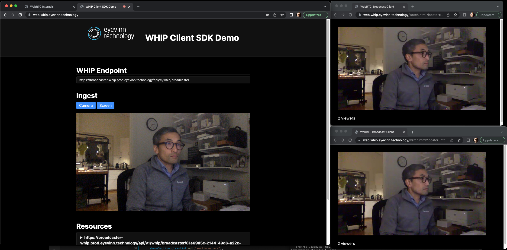

# WebRTC-HTTP ingestion protocol



Live demo at [web.whip.eyevinn.technology](https://web.whip.eyevinn.technology)

Client and Server modules for WebRTC HTTP Ingestion Protocol (WHIP)

| Module | Description |
| ------ | ----------- |
| [@eyevinn/whip-endpoint](https://www.npmjs.com/package/@eyevinn/whip-endpoint) | Server endpoint for providing WHIP resources |
| [@eyevinn/whip-web-client](https://www.npmjs.com/package/@eyevinn/whip-web-client) | Client Javascript SDK for browser based WHIP client (WebRTC producer) |

## Getting started

This will setup a WHIP endpoint, a demo ingest client and an WHPP based egress endpoint to be able to test end-to-end.

Install all dependencies

```
npm install
```

Run development environment which will launch a demo / test page at http://localhost:1234 and a WHIP endpoint at http://localhost:8000/api/v2

```
npm run dev
```

Start media server and WHPP egress endoint as docker containers

```
docker-compose -f docker-compose-sfu.yml up
```

### With TLS termination

```
NODE_ENV=development \ 
TLS_TERMINATION_ENABLED=true \
WHIP_ENDPOINT_USE_HTTPS=true \
npm run dev
```

### Develop against demo backend

```
NODE_ENV=production npm run dev
```

To fetch ICE config from remote

```
API_KEY=<secret> ICE_CONFIG_REMOTE=1 NODE_ENV=production npm run dev
```

## License (Apache-2.0)

```
Copyright 2022 Eyevinn Technology AB

Licensed under the Apache License, Version 2.0 (the "License");
you may not use this file except in compliance with the License.
You may obtain a copy of the License at

    http://www.apache.org/licenses/LICENSE-2.0

Unless required by applicable law or agreed to in writing, software
distributed under the License is distributed on an "AS IS" BASIS,
WITHOUT WARRANTIES OR CONDITIONS OF ANY KIND, either express or implied.
See the License for the specific language governing permissions and
limitations under the License.
```

## Support

Join our [community on Slack](http://slack.streamingtech.se) where you can post any questions regarding any of our open source projects. If you fancy any help in enhancing or integrating this component just drop an email to sales@eyevinn.se and we'll figure something out together.

## About Eyevinn Technology

[Eyevinn Technology](https://www.eyevinntechnology.se) is an independent consultant firm specialized in video and streaming. Independent in a way that we are not commercially tied to any platform or technology vendor. As our way to innovate and push the industry forward we develop proof-of-concepts and tools. The things we learn and the code we write we share with the industry in [blogs](https://dev.to/video) and by open sourcing the code we have written.

Want to know more about Eyevinn and how it is to work here. Contact us at work@eyevinn.se!
